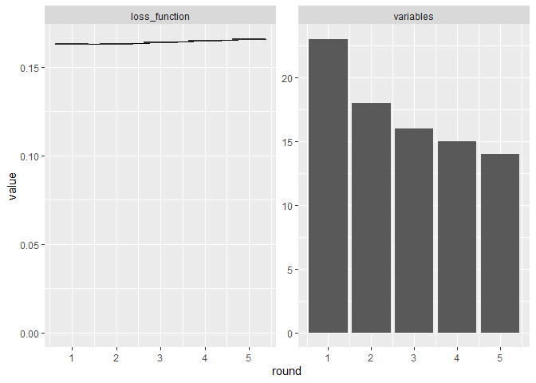
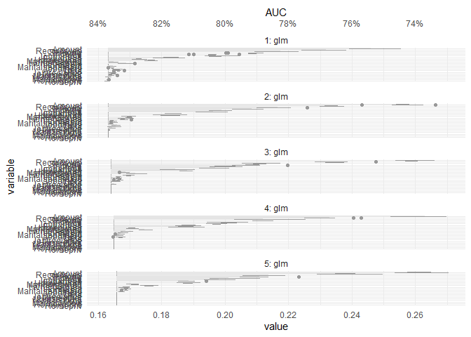

<!-- README.md is generated from README.Rmd. Please edit that file -->

# celavi

<!-- badges: start -->

[](https://github.com/jbkunst/celavi/actions/workflows/R-CMD-check.yaml)
<!-- badges: end -->

The goal of celavi is to join the main features of two functions  
that I use *really* often `vip::vi_permute` and `DALEX::model_parts`.
Both functions do the *same* task of calculate *drop out loss via
permutation*, but they have different features and approach.

In the case of `vip::vi_permute` is more direct to use (imho), have an
implementation for parallel processing, can be used with a `sample_frac`
parameter. Otherwise, in the case of `DALEX::model_parts` I like the
user can give custom `metric`s as a loss functions, the *base line* and
*full model* references values, and the plots.

To that features I added some features to my *personal* taste.

-   Add progress bars to the sequential and parallel process using
    `progress::progress_bar` and `progressr::progress`
-   Give the possibility of to the user to access to the *raw* data.
-   Verbose information using `cli::cli_alert_info`.

## References

The `vip` package from [koalaverse](https://github.com/koalaverse), and
the `DALEX` package from [MI²](https://www.mi2.ai/). In particular these
links are awesome: <https://koalaverse.github.io/vip/articles/vip.html>
and <https://ema.drwhy.ai/featureImportance.html#featureImportanceR>.

Please, visit the links and used that awesome tools!

## Installation

You can install the development version of celavi from
[GitHub](https://github.com/) with:

``` r
# install.packages("devtools")
devtools::install_github("jbkunst/celavi")
```

## Example I: Variable Importance

``` r
library(celavi)

lm_model <- lm(mpg ~ ., data = mtcars)

set.seed(123)

vi <- celavi::variable_importance(lm_model, data = mtcars, iterations = 10)
#> ℹ Using all variables in data.
#> ℹ Trying extract response name using `formula`.
#> ℹ Using `mpg` as response.
#> ℹ Using root mean square error as loss function.
#> ℹ Using `base::identity` as sampler.
#> ℹ Using `predict.lm` as predict function.

dplyr::glimpse(vi)
#> Rows: 120
#> Columns: 3
#> $ variable  <chr> "am", "am", "am", "am", "am", "am", "am", "am", "am", "am", …
#> $ iteration <int> 1, 2, 3, 4, 5, 6, 7, 8, 9, 10, 1, 2, 3, 4, 5, 6, 7, 8, 9, 10…
#> $ value     <dbl> 2.718690, 2.813226, 2.629602, 3.006321, 2.810651, 2.780096, …

nrow(vi)
#> [1] 120
# nrow(vi) = (ncol(mtcars) - 1 + 2) * iterations

plot(vi)
```


And compare with other model.

``` r
rf <- randomForest::randomForest(mpg ~ ., data = mtcars)

vi_rf <- celavi::variable_importance(rf, data = mtcars, iterations = 10)
#> ℹ Using all variables in data.
#> ℹ Trying extract response name using `formula`.
#> ℹ Using `mpg` as response.
#> ℹ Using root mean square error as loss function.
#> ℹ Using `base::identity` as sampler.
#> ℹ Using `predict.randomForest` as predict function.

plot(vi, vi_rf)
```


From the previous chart we can tell the random Forest have small
(better) RMSE and is less affected in terms of predictability by
removing variables, wt variable for example.

## Example II: Feature Selection

``` r
set.seed(123)

data(credit_data, package = "modeldata")

credit_data <- credit_data[complete.cases(credit_data),]
credit_data$Status <- as.numeric(credit_data$Status) - 1

# convert factor to dummies (to compare results with glmnet)
credit_data <- as.data.frame(model.matrix(~ . - 1, data = credit_data))

trn_tst <- sample(
  c(TRUE, FALSE),
  size = nrow(credit_data),
  replace = TRUE, 
  prob = c(.7, .3)
  )

credit_data_trn <- credit_data[ trn_tst,]
credit_data_tst <- credit_data[!trn_tst,]

fs <- feature_selection(
  glm,
  credit_data_trn,
  response = "Status",
  stat = min,
  iterations = 10,
  sample_frac = 1, 
  predict_function = predict.glm,
  # function accepts specific argument for the fit function
  family  = binomial
)
#> ℹ Using 1 - AUCROC as loss function.
#> ℹ Fitting 1st model using 23 predictor variables.
#> 
#> ── Round #1 ──
#> 
#> ℹ Using `dplyr::sample_frac` as sampler.
#> ℹ Removing 5 variables. Fitting new model with 18 variables.
#> 
#> ── Round #2 ──
#> 
#> ℹ Using `dplyr::sample_frac` as sampler.
#> ℹ Removing 2 variables. Fitting new model with 16 variables.
#> 
#> ── Round #3 ──
#> 
#> ℹ Using `dplyr::sample_frac` as sampler.
#> ℹ Removing 1 variables. Fitting new model with 15 variables.
#> 
#> ── Round #4 ──
#> 
#> ℹ Using `dplyr::sample_frac` as sampler.
#> ℹ Removing 1 variables. Fitting new model with 14 variables.
#> 
#> ── Round #5 ──
#> 
#> ℹ Using `dplyr::sample_frac` as sampler.

fs
#> # A tibble: 5 × 5
#>   round mean_value values     n_variables variables 
#>   <dbl>      <dbl> <list>           <int> <list>    
#> 1     1      0.163 <dbl [10]>          23 <chr [23]>
#> 2     2      0.163 <dbl [10]>          18 <chr [18]>
#> 3     3      0.164 <dbl [10]>          16 <chr [16]>
#> 4     4      0.165 <dbl [10]>          15 <chr [15]>
#> 5     5      0.166 <dbl [10]>          14 <chr [14]>

plot(fs)
```



We have a simpler model without loss significance predictive
performance.

Nopw we can compare with some other feature selection techniques.

``` r
mod_fs <- attr(fs, "final_fit")

mod_full <- glm(Status ~ ., data = credit_data_trn, family = binomial)

mod_step <- step(mod_full, trace = FALSE) 

# wrapper around glmnet::cv.glmnet()
mod_lasso <- risk3r::featsel_glmnet(mod_full, plot = FALSE)
```

``` r
models <- list(
  "fs by vip" = mod_fs,
  "stepwise"  = mod_step,
  "lasso"     = mod_lasso
)

purrr::map_df(
  models,
  risk3r::model_metrics,
  newdata = credit_data_tst, 
  .id = "method"
)
#> # A tibble: 3 × 5
#>   method       ks   auc    iv  gini
#>   <chr>     <dbl> <dbl> <dbl> <dbl>
#> 1 fs by vip 0.530 0.839  1.89 0.679
#> 2 stepwise  0.536 0.842  1.91 0.685
#> 3 lasso     0.527 0.839  1.91 0.679
```

Not the best model in terms of metrics. But if we see the number of
coefficients:

``` r
purrr::map_df(
  models,
  ~ tibble::tibble(`# variables` =  length(coef(.x))),
  .id = "method"
)
#> # A tibble: 3 × 2
#>   method    `# variables`
#>   <chr>             <int>
#> 1 fs by vip            15
#> 2 stepwise             18
#> 3 lasso                18
```

We can check the loss in each iteration, so you can choose what
combintations of loss/number of variables you want.

``` r
do.call(plot, attr(fs, "variable_importance")) +
  ggplot2::scale_y_continuous(
    breaks = scales::pretty_breaks(7),
    sec.axis = ggplot2::dup_axis(~ 1 - .x, name = "AUC", labels = scales::percent)
  )
#> Scale for 'y' is already present. Adding another scale for 'y', which will
#> replace the existing scale.
```



``` r
fs
#> # A tibble: 5 × 5
#>   round mean_value values     n_variables variables 
#>   <dbl>      <dbl> <list>           <int> <list>    
#> 1     1      0.163 <dbl [10]>          23 <chr [23]>
#> 2     2      0.163 <dbl [10]>          18 <chr [18]>
#> 3     3      0.164 <dbl [10]>          16 <chr [16]>
#> 4     4      0.165 <dbl [10]>          15 <chr [15]>
#> 5     5      0.166 <dbl [10]>          14 <chr [14]>
```
