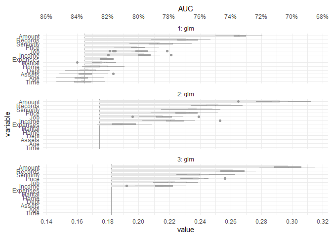

<!-- README.md is generated from README.Rmd. Please edit that file -->

# celavi

<!-- badges: start -->

[](https://github.com/jbkunst/celavi/actions/workflows/R-CMD-check.yaml)
<!-- badges: end -->

The goal of celavi is to join the main features of two functions  
that I use *really* often `vip::vi_permute` and `DALEX::model_parts`.
Both functions do the *same* task of calculate *drop out loss via
permutation*, but they have different features and approach.

In the case of `vip::vi_permute` is more direct to use (imho), have an
implementation for parallel processing, can be used with a `sample_frac`
parameter. Otherwise, in the case of `DALEX::model_parts` I like the
user can give custom `metric`s as a loss functions, the *base line* and
*full model* references values, and the plots.

To that features I added some features to my *personal* taste.

-   Add progress bars to the sequential and parallel process using
    `progress::progress_bar` and `progressr::progress`
-   Give the possibility of to the user to access to the *raw* data.
-   Verbose information using `cli::cli_alert_info`.

## References

The `vip` package from [koalaverse](https://github.com/koalaverse), and
the `DALEX` package from [MI²](https://www.mi2.ai/). In particular these
links are awesome: <https://koalaverse.github.io/vip/articles/vip.html>
and <https://ema.drwhy.ai/featureImportance.html#featureImportanceR>.

Please, visit the links and used that awesome tools!

## Installation

You can install the development version of celavi from
[GitHub](https://github.com/) with:

``` r
# install.packages("devtools")
devtools::install_github("jbkunst/celavi")
```

## Example I: Variable Importance

``` r
library(celavi)

lm_model <- lm(mpg ~ ., data = mtcars)

set.seed(123)

vi <- celavi::variable_importance(lm_model, data = mtcars, iterations = 10)
#> ℹ Using all variables in data.
#> ℹ Trying extract response name using `formula`.
#> ℹ Using `mpg` as response.
#> ℹ Using root mean square error as loss function.
#> ℹ Using `base::identity` as sampler.
#> ℹ Using `predict.lm` as predict function.

dplyr::glimpse(vi)
#> Rows: 120
#> Columns: 3
#> $ variable  <chr> "am", "am", "am", "am", "am", "am", "am", "am", "am", "am", …
#> $ iteration <int> 1, 2, 3, 4, 5, 6, 7, 8, 9, 10, 1, 2, 3, 4, 5, 6, 7, 8, 9, 10…
#> $ value     <dbl> 2.718690, 2.813226, 2.629602, 3.006321, 2.810651, 2.780096, …

nrow(vi)
#> [1] 120
# nrow(vi) = (ncol(mtcars) - 1 + 2) * iterations

plot(vi)
```


And compare with other model.

``` r
rf <- randomForest::randomForest(mpg ~ ., data = mtcars)

vi_rf <- celavi::variable_importance(rf, data = mtcars, iterations = 10)
#> ℹ Using all variables in data.
#> ℹ Trying extract response name using `formula`.
#> ℹ Using `mpg` as response.
#> ℹ Using root mean square error as loss function.
#> ℹ Using `base::identity` as sampler.
#> ℹ Using `predict.randomForest` as predict function.

plot(vi, vi_rf)
```


From the previous chart we can tell the random Forest have small
(better) RMSE and is less affected in terms of predictability by
removing variables, wt variable for example.

## Example II: Feature Selection

``` r
set.seed(123)

data(credit_data, package = "modeldata")

credit_data <- credit_data[complete.cases(credit_data),]

fs <- feature_selection(
  # randomForest:::randomForest.formula,
  glm,
  credit_data,
  response = "Status",
  stat = min,
  iterations = 20,
  sample_frac = .5, 
  predict_function = predict.glm,
  # function accepts specific argument for the fit function
  family  = binomial,
  
)
#> ℹ Using 1 - AUCROC as loss function.
#> ℹ Fitting 1st model using 13 predictor variables.
#> 
#> ── Round #1 ──
#> 
#> ℹ Using `dplyr::sample_frac` as sampler.
#> ℹ Removing 6 variables. Fitting new model with 7 variables.
#> 
#> ── Round #2 ──
#> 
#> ℹ Using `dplyr::sample_frac` as sampler.
#> ℹ Removing 1 variables. Fitting new model with 6 variables.
#> 
#> ── Round #3 ──
#> 
#> ℹ Using `dplyr::sample_frac` as sampler.

fs
#> # A tibble: 3 × 5
#>   round mean_value values     n_variables variables 
#>   <dbl>      <dbl> <list>           <int> <list>    
#> 1     1      0.165 <dbl [20]>          13 <chr [13]>
#> 2     2      0.175 <dbl [20]>           7 <chr [7]> 
#> 3     3      0.182 <dbl [20]>           6 <chr [6]>

plot(fs)
```


We have a simpler model with 6 variables without loss significance
predictive performance.

``` r
do.call(plot, attr(fs, "variable_importance")) +
  ggplot2::scale_y_continuous(
    breaks = scales::pretty_breaks(7),
    sec.axis = ggplot2::dup_axis(~ 1 - .x, name = "AUC", labels = scales::percent)
  )
#> Scale for 'y' is already present. Adding another scale for 'y', which will
#> replace the existing scale.
```



``` r
tail(fs$variables, 1)
#> [[1]]
#> [1] "Amount"    "Records"   "Seniority" "Price"     "Income"    "Job"

step(glm(Status ~ ., data = credit_data, family = binomial), trace = FALSE, k = 100)
#> 
#> Call:  glm(formula = Status ~ Seniority + Records + Income + Amount + 
#>     Price, family = binomial, data = credit_data)
#> 
#> Coefficients:
#> (Intercept)    Seniority   Recordsyes       Income       Amount        Price  
#>    0.350841     0.101281    -1.743761     0.007080    -0.002194     0.001270  
#> 
#> Degrees of Freedom: 4038 Total (i.e. Null);  4033 Residual
#> Null Deviance:       4578 
#> Residual Deviance: 3668  AIC: 3680
```
