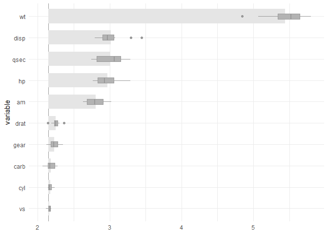

<!-- README.md is generated from README.Rmd. Please edit that file -->

# celavi

<!-- badges: start -->

[](https://github.com/jbkunst/celavi/actions/workflows/R-CMD-check.yaml)
<!-- badges: end -->

The goal of celavi is to join the main features of two functions  
that I use *really* often `vip::vi_permute` and `DALEX::model_parts`.
Both functions do the *same* task of calculate *drop out loss via
permutation*, but they have different features and approach.

In the case of `vip::vi_permute` is more direct to use (imho), have an
implementation for parallel processing, can be used with a `sample_frac`
parameter. Otherwise, in the case of `DALEX::model_parts` I like the
user can give custom `metric`s as a loss functions, the *base line* and
*full model* references values, and the plots.

To that features I added some features to my *personal* taste.

-   Add progress bars to the sequential and parallel process using
    `progress::progress_bar` and `progressr::progress`
-   Give the possibility of to the user to access to the *raw* data.
-   Verbose information using `cli::cli_alert_info`.

## References

The `vip` package from [koalaverse](https://github.com/koalaverse), and
the `DALEX` package from [MI²](https://www.mi2.ai/). In particular these
links are awesome: <https://koalaverse.github.io/vip/articles/vip.html>
and <https://ema.drwhy.ai/featureImportance.html#featureImportanceR>.

Please, visit the links and used that awesome tools!

## Installation

You can install the development version of celavi from
[GitHub](https://github.com/) with:

``` r
# install.packages("devtools")
devtools::install_github("jbkunst/celavi")
```

## Example

``` r
library(celavi)

lm_model <- lm(mpg ~ ., data = mtcars)

set.seed(123)

vi <- celavi::variable_importance(lm_model, data = mtcars, iterations = 10)
#> ℹ Using all variables in data.
#> ℹ Trying extract response name using `formula`.
#> ℹ Using `mpg` as response.
#> ℹ Using root mean square error as metric.
#> ℹ Using `base::identity` as sampler.
#> ℹ Using `predict.lm` as predict function.

dplyr::glimpse(vi)
#> Rows: 120
#> Columns: 3
#> $ variable  <chr> "am", "am", "am", "am", "am", "am", "am", "am", "am", "am", …
#> $ iteration <int> 1, 2, 3, 4, 5, 6, 7, 8, 9, 10, 1, 2, 3, 4, 5, 6, 7, 8, 9, 10…
#> $ value     <dbl> 2.718690, 2.813226, 2.629602, 3.006321, 2.810651, 2.780096, …

nrow(vi)
#> [1] 120
# nrow(vi) = (ncol(mtcars) - 1 + 2) * iterations

plot(vi)
```



And compare with other model.

``` r
rf <- randomForest::randomForest(mpg ~ ., data = mtcars)

vi_rf <- celavi::variable_importance(rf, data = mtcars, iterations = 10)
#> ℹ Using all variables in data.
#> ℹ Trying extract response name using `formula`.
#> ℹ Using `mpg` as response.
#> ℹ Using root mean square error as metric.
#> ℹ Using `base::identity` as sampler.
#> ℹ Using `predict.randomForest` as predict function.

plot(vi, vi_rf)
```


From the previous chart we can tell the random Forest have small
(better) RMSE and is less affected in terms of predictability by
removing variables, wt variable for example.
