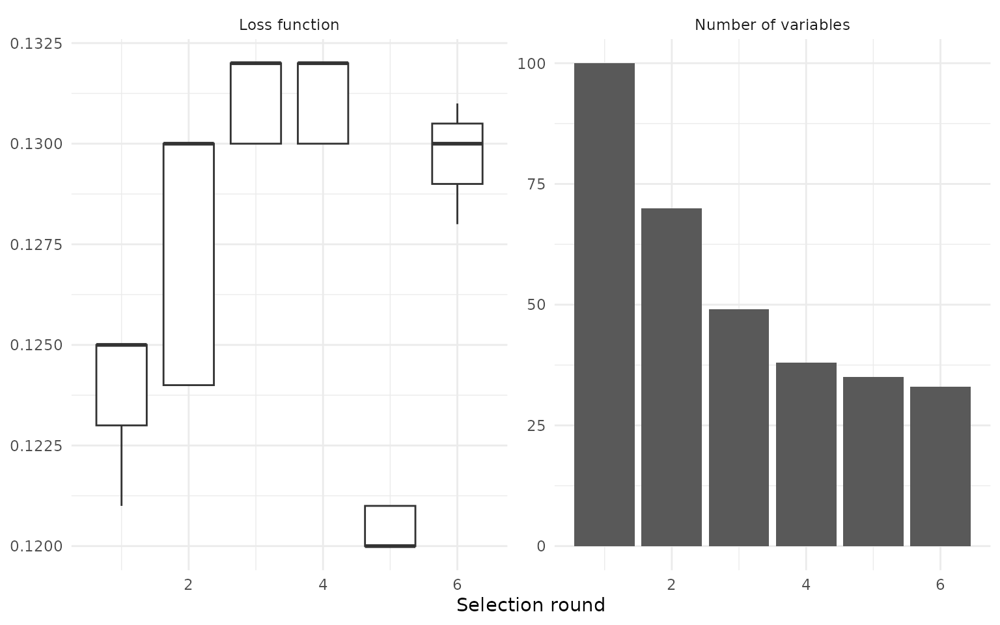

# Feature selection on MNIST data

``` r

library(celavi)
library(dplyr)
library(ggplot2)
library(klassets)
library(ranger)
library(tidyr)
```

## Feature selection on MNIST data

This article shows how `celavi` can be used to visualize the trade-off
between predictive performance and model simplicity.

The example uses a reduced version of the MNIST data. The goal is not to
build the best possible MNIST classifier, but to show how the
feature-selection procedure removes variables across rounds and how much
predictive performance is lost in the process.

``` r

set.seed(123)

n_train  <- 10000
n_test   <- 1000
n_pixels <- 100
iter     <- 15
frac     <- 1

num_trees     <- 100
max_depth     <- 8
min_node_size <- 20

stat_fun <- median
```

The experiment uses 10^{4} training observations, 1000 test
observations, and 100 randomly selected pixel variables.

The argument `iter = r iter` controls how many permutation losses are
estimated for each variable in each selection round. It does not fix the
number of selection rounds. The number of rounds depends on how many
variables are removed after each step.

``` r

pixel_cols <- sample(setdiff(names(klassets::mnist_train), "label"), n_pixels)

data <- klassets::mnist_train |>
  dplyr::mutate(label = factor(label)) |>
  dplyr::slice_sample(n = n_train) |>
  dplyr::select(label, dplyr::all_of(pixel_cols))

test <- klassets::mnist_test |>
  dplyr::mutate(label = factor(label)) |>
  dplyr::slice_sample(n = n_test) |>
  dplyr::select(label, dplyr::all_of(pixel_cols))
```

## Feature selection procedure

At each round, `celavi` fits a model, estimates the loss caused by
permuting each variable, and removes variables that do not contribute
enough to predictive performance.

Because `label` is a multiclass factor, the default loss function is
based on classification accuracy. Lower loss values indicate better
predictive performance.

``` r

x <- feature_selection(
  ranger::ranger,
  data = data,
  test = test,
  response = "label",
  stat = stat_fun,
  iterations = iter,
  sample_frac = frac,
  predict_function = function(object, newdata) {
    predict(object, data = newdata)$predictions
  },
  parallel = FALSE,
  # ranger-specific arguments
  num.trees = num_trees,
  max.depth = max_depth,
  min.node.size = min_node_size,
  num.threads = 1
)
x
#> # A tibble: 6 × 5
#>   round mean_value values     n_variables variables  
#>   <dbl>      <dbl> <list>           <int> <list>     
#> 1     1      0.124 <dbl [15]>         100 <chr [100]>
#> 2     2      0.128 <dbl [15]>          70 <chr [70]> 
#> 3     3      0.131 <dbl [15]>          49 <chr [49]> 
#> 4     4      0.131 <dbl [15]>          38 <chr [38]> 
#> 5     5      0.120 <dbl [15]>          35 <chr [35]> 
#> 6     6      0.130 <dbl [15]>          33 <chr [33]>
```

``` r

selection_summary <- x |>
  dplyr::transmute(
    round,
    loss = mean_value,
    accuracy = 1 - mean_value,
    n_variables
  )

selection_summary
#> # A tibble: 6 × 4
#>   round  loss accuracy n_variables
#>   <dbl> <dbl>    <dbl>       <int>
#> 1     1 0.124    0.876         100
#> 2     2 0.128    0.872          70
#> 3     3 0.131    0.869          49
#> 4     4 0.131    0.869          38
#> 5     5 0.120    0.880          35
#> 6     6 0.130    0.870          33
```

## Selection path

``` r

loss_data <- x |>
  dplyr::select(round, values) |>
  tidyr::unnest(values) |>
  dplyr::transmute(
    round,
    metric = "Loss function",
    value = values
  )

variables_data <- x |>
  dplyr::transmute(
    round,
    metric = "Number of variables",
    value = n_variables
  )

plot_data <- dplyr::bind_rows(loss_data, variables_data)

ggplot2::ggplot() +
  ggplot2::geom_boxplot(
    data = dplyr::filter(plot_data, metric == "Loss function"),
    ggplot2::aes(round, value, group = round)
  ) +
  ggplot2::geom_col(
    data = dplyr::filter(plot_data, metric == "Number of variables"),
    ggplot2::aes(round, value)
  ) +
  ggplot2::facet_wrap(ggplot2::vars(metric), scales = "free_y") +
  ggplot2::labs(
    x = "Selection round",
    y = NULL
  ) +
  ggplot2::theme_minimal()
```



The left panel shows the distribution of the loss function across
selection rounds. The right panel shows the number of variables kept by
the model.

The expected trade-off is visible: the number of predictors falls
sharply, while the loss function changes as the model is refitted with
fewer variables.

The loss does not need to increase monotonically. After each round, the
model is trained again using the remaining variables, and removing weak
or noisy pixels can sometimes keep the loss stable. The main purpose of
the example is to show how `celavi` makes this selection path visible.

``` r

first_round <- selection_summary |>
  dplyr::slice_min(round, n = 1)

last_round <- selection_summary |>
  dplyr::slice_max(round, n = 1)

initial_variables <- first_round$n_variables
final_variables <- last_round$n_variables

initial_accuracy <- first_round$accuracy
final_accuracy <- last_round$accuracy

variable_reduction <- 1 - final_variables / initial_variables
accuracy_change_pp <- 100 * (final_accuracy - initial_accuracy)
```

In this run, the model starts with 100 variables and finishes with 33
variables. This is a reduction of approximately 67% of the original
predictors.

The estimated predictive accuracy changes from approximately 87.6% to
87.0%. This is a change of about -0.6 percentage points.

This article is intentionally small enough to render quickly. The
objective is not to optimize MNIST performance, but to make the
feature-selection path easy to inspect.
