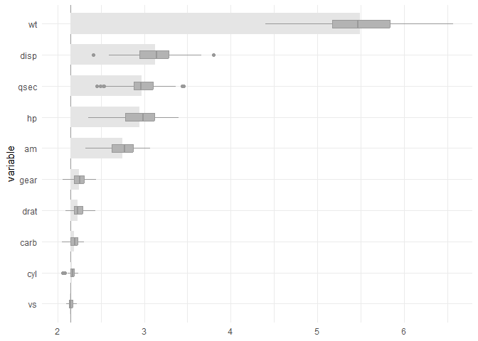
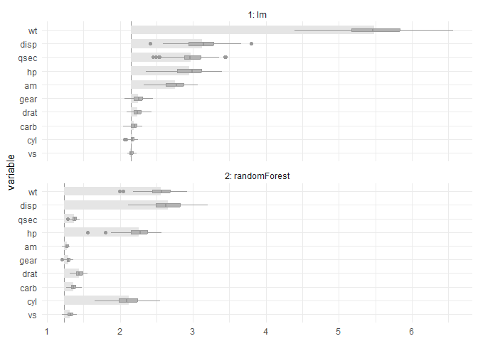
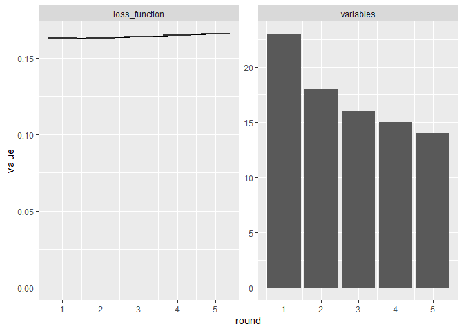
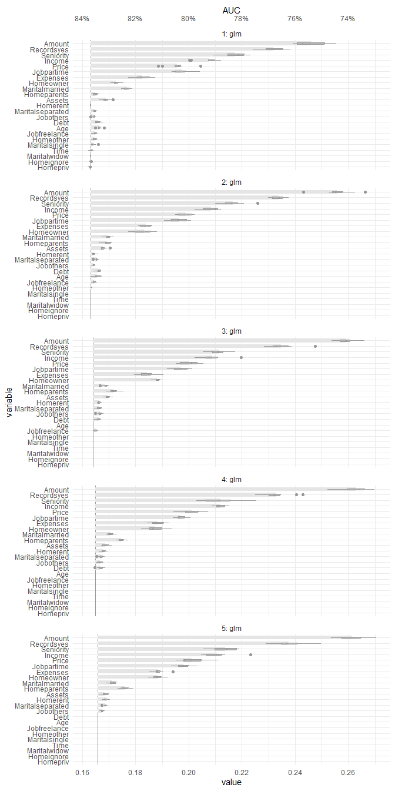

# celavi

`celavi` provides permutation-based variable importance and feature
selection tools.

The package is inspired by two functions I use often:
`vip::vi_permute()` and `DALEX::model_parts()`. Both estimate variable
importance by measuring the drop-out loss after permuting predictors,
but they have different strengths.

`vip::vi_permute()` is direct to use, supports parallel processing, and
works well with sampling arguments such as `sample_frac`.
`DALEX::model_parts()` makes it easy to use custom loss functions,
compare against baseline and full-model reference values, and produce
useful plots.

`celavi` keeps the parts I like from both approaches and adds a few
conveniences:

- progress bars for sequential and parallel runs;
- access to the raw permutation results;
- informative messages through `cli`;
- a lightweight iterative feature-selection workflow.

## References

`celavi` is inspired by:

- `vip`, from the koalaverse:
  <https://koalaverse.github.io/vip/articles/vip.html>
- `DALEX`, from MI²:
  <https://ema.drwhy.ai/featureImportance.html#featureImportanceR>

Both are excellent packages. `celavi` is not intended to replace them;
it is a small package focused on my preferred workflow for permutation
importance and feature selection.

## Installation

You can install the package from GitHub with:

``` r

pak::pkg_install("jbkunst/celavi")
```

## Example I: Variable Importance

``` r

library(celavi)

lm_model <- lm(mpg ~ ., data = mtcars)

set.seed(123)

vi <- celavi::variable_importance(lm_model, data = mtcars, iterations = 100)
#> ℹ Using all variables in data.
#> ℹ Trying extract response name using `formula`.
#> ℹ Using `mpg` as response.
#> ℹ Using root mean square error as loss function.
#> ℹ Using `base::identity` as sampler.
#> ℹ Using `predict.lm` as predict function.

dplyr::glimpse(vi)
#> Rows: 1,200
#> Columns: 3
#> $ variable  <chr> "am", "am", "am", "am", "am", "am", "am", "am", "am", "am", "am", "am", "am", "am", "am", "am", "am", "am", "am", "am", "am", "am", "am", "am", "am", "am", "…
#> $ iteration <int> 1, 2, 3, 4, 5, 6, 7, 8, 9, 10, 11, 12, 13, 14, 15, 16, 17, 18, 19, 20, 21, 22, 23, 24, 25, 26, 27, 28, 29, 30, 31, 32, 33, 34, 35, 36, 37, 38, 39, 40, 41, 42…
#> $ value     <dbl> 2.718690, 2.813226, 2.629602, 3.006321, 2.810651, 2.780096, 3.020727, 2.654327, 2.674945, 2.939642, 3.071645, 2.846018, 2.657221, 2.853331, 3.006846, 2.84278…

nrow(vi)
#> [1] 1200
# nrow(vi) == (ncol(mtcars) - 1 + 2) * iterations

plot(vi)
```



And compare with other model.

``` r

rf <- randomForest::randomForest(mpg ~ ., data = mtcars)

vi_rf <- celavi::variable_importance(rf, data = mtcars, iterations = 100)
#> ℹ Using all variables in data.
#> ℹ Trying extract response name using `formula`.
#> ℹ Using `mpg` as response.
#> ℹ Using root mean square error as loss function.
#> ℹ Using `base::identity` as sampler.
#> ℹ Using `predict.randomForest` as predict function.

plot(vi, vi_rf)
```



The previous chart shows that the random forest has a smaller, better
RMSE. It is also less affected by permuting some predictors. For
example, permuting `wt` has a visible impact on the linear model.

## Example II: Feature Selection

``` r

set.seed(123)

data(credit_data, package = "modeldata")

credit_data <- credit_data[complete.cases(credit_data),]
credit_data$Status <- as.numeric(credit_data$Status) - 1

# convert factor to dummies (to compare results with glmnet)
credit_data <- as.data.frame(model.matrix(~ . - 1, data = credit_data))

trn_tst <- sample(
  c(TRUE, FALSE),
  size = nrow(credit_data),
  replace = TRUE, 
  prob = c(.7, .3)
  )

credit_data_trn <- credit_data[ trn_tst,]
credit_data_tst <- credit_data[!trn_tst,]

fs <- feature_selection(
  glm,
  credit_data_trn,
  response = "Status",
  stat = min,
  iterations = 10,
  sample_frac = 1, 
  predict_function = predict.glm,
  # function accepts specific argument for the fit function
  family  = binomial
)
#> ℹ Using 1 - AUCROC as loss function.
#> ℹ Fitting 1st model using 23 predictor variables.
#> 
#> ── Round #1 ──
#> 
#> ℹ Using `dplyr::sample_frac` as sampler.
#> ℹ Removing 5 variables. Fitting new model with 18 variables.
#> 
#> ── Round #2 ──
#> 
#> ℹ Using `dplyr::sample_frac` as sampler.
#> ℹ Removing 2 variables. Fitting new model with 16 variables.
#> 
#> ── Round #3 ──
#> 
#> ℹ Using `dplyr::sample_frac` as sampler.
#> ℹ Removing 1 variables. Fitting new model with 15 variables.
#> 
#> ── Round #4 ──
#> 
#> ℹ Using `dplyr::sample_frac` as sampler.
#> ℹ Removing 1 variables. Fitting new model with 14 variables.
#> 
#> ── Round #5 ──
#> 
#> ℹ Using `dplyr::sample_frac` as sampler.

fs
#> # A tibble: 5 × 5
#>   round mean_value values     n_variables variables 
#>   <dbl>      <dbl> <list>           <int> <list>    
#> 1     1      0.163 <dbl [10]>          23 <chr [23]>
#> 2     2      0.163 <dbl [10]>          18 <chr [18]>
#> 3     3      0.164 <dbl [10]>          16 <chr [16]>
#> 4     4      0.165 <dbl [10]>          15 <chr [15]>
#> 5     5      0.166 <dbl [10]>          14 <chr [14]>

plot(fs)
```



The result is a simpler model with little apparent loss in predictive
performance.

Now we can compare with some other feature selection techniques.

``` r

mod_fs <- attr(fs, "final_fit")

mod_full <- glm(Status ~ ., data = credit_data_trn, family = binomial)

mod_step <- step(mod_full, trace = FALSE) 

# wrapper around glmnet::cv.glmnet()
mod_lasso <- risk3r::featsel_glmnet(mod_full, plot = FALSE)
```

``` r

models <- list(
  "featsel by vip" = mod_fs,
  "stepwise"  = mod_step,
  "lasso"     = mod_lasso
)

dmetrics <- purrr::map_df(
  models,
  risk3r::model_metrics,
  newdata = credit_data_tst, 
  .id = "method"
)
#> ℹ Creating woe binning ...
#> ℹ Creating woe binning ...
#> ℹ Creating woe binning ...

dmetrics
#> # A tibble: 3 × 5
#>   method            ks   auc    iv  gini
#>   <chr>          <dbl> <dbl> <dbl> <dbl>
#> 1 featsel by vip 0.530 0.839  1.89 0.679
#> 2 stepwise       0.536 0.842  1.91 0.685
#> 3 lasso          0.527 0.839  1.91 0.679
```

Not the best model in terms of metrics. But if we see the number of
coefficients:

``` r

dnvars <- purrr::map_df(
  models,
  ~ tibble::tibble(`# variables` =  length(coef(.x))),
  .id = "method"
)

dplyr::full_join(dnvars, dmetrics, by = dplyr::join_by(method))
#> # A tibble: 3 × 6
#>   method         `# variables`    ks   auc    iv  gini
#>   <chr>                  <int> <dbl> <dbl> <dbl> <dbl>
#> 1 featsel by vip            15 0.530 0.839  1.89 0.679
#> 2 stepwise                  18 0.536 0.842  1.91 0.685
#> 3 lasso                     18 0.527 0.839  1.91 0.679
```

We can check the loss in each iteration, so you can choose what
combinations of loss/number of variables you want.

``` r

do.call(plot, attr(fs, "variable_importance")) +
  ggplot2::scale_y_continuous(
    breaks = scales::pretty_breaks(7),
    sec.axis = ggplot2::dup_axis(~ 1 - .x, name = "AUC", labels = scales::percent)
  )
#> Scale for y is already present.
#> Adding another scale for y, which will replace the existing scale.
```



``` r


fs
#> # A tibble: 5 × 5
#>   round mean_value values     n_variables variables 
#>   <dbl>      <dbl> <list>           <int> <list>    
#> 1     1      0.163 <dbl [10]>          23 <chr [23]>
#> 2     2      0.163 <dbl [10]>          18 <chr [18]>
#> 3     3      0.164 <dbl [10]>          16 <chr [16]>
#> 4     4      0.165 <dbl [10]>          15 <chr [15]>
#> 5     5      0.166 <dbl [10]>          14 <chr [14]>
```
